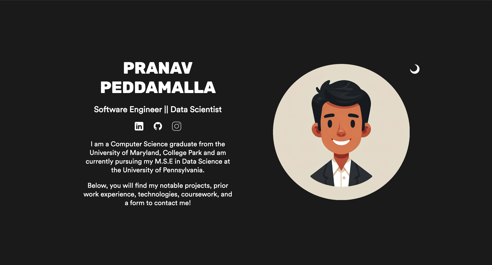
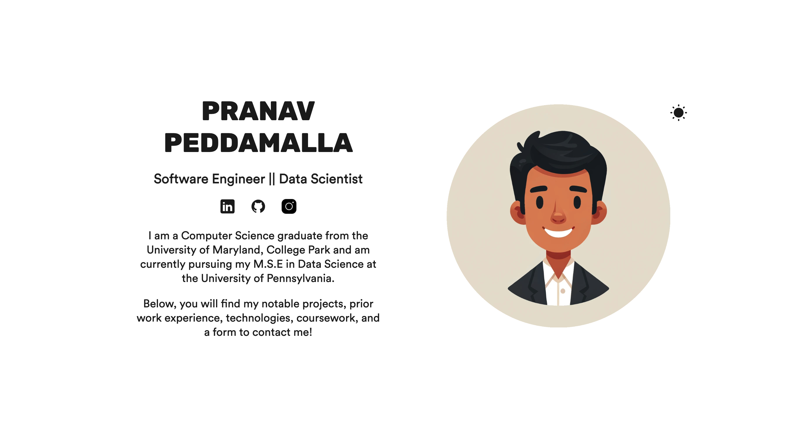

# Personal Portfolio v2.0

### About
This website, built using React.js and Vite, showcases my aspirations, project work, prior work experience, technological background, and a form to contact me. It is a dynamic platform that I will continuously enhance as I gain more experience in software development. This is not the final product but rather an evolving portfolio to display my resume in an aesthetically pleasing manner and to practice my software development skills. 

Visit my site here: <https://pranavpedd.netlify.app/>

### Technologies used

* React.js
* Vite
* JavaScript, HTML, CSS
* Deployed on [Netlify](https://www.netlify.com/)

### Design choices

#### Fonts

| Font  | Source |
| ----  | --------|
| Rubik | <https://fonts.google.com/specimen/Rubik?query=rubik> |
| CircularStd | <https://befonts.com/circular-std-font.html> |

#### Colors

| Color      | Hex                             |
|------------|---------------------------------|
| White      |  #fff |
| The rainbow fish       |  #4361EE |
| Black out      |  #222 |
| Gravel fint       |  #bbb |
| Stone cold |  #555 |

### Future plans

* Connect my custom domain
* Purchase an SSL certificate to allow HTTPS connections
* * Add more work experiences as I get them!

### References

* Icons are from [icons8](https://icons8.com)
* Company logos are from [Google Images](https://images.google.com/)
* Pfp and project icons are from [ChatGPT](https://chatgpt.com) using the DALL-E model  
* Fonts were imported/downloaded from [Google Fonts](https://fonts.google.com/) and [BeFonts](https://befonts.com/)
* Animations were done using [React Awesome Reveal](https://www.npmjs.com/package/react-awesome-reveal)
